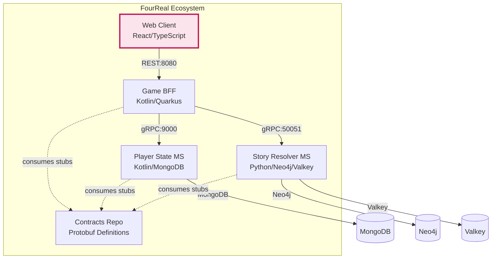

# FourReal Web Client MVP

Temporary Web client for the FourReal interactive fiction platform - built with React, TypeScript, and Vite.

## Contents

- [Ecosystem Architecture](#ecosystem-architecture)
- [Stack](#stack)
- [Quick Start](#quick-start)
- [Development](#development)
- [Development Standards](#development-standards)

## Ecosystem Architecture



## Stack

- **React 19** + **TypeScript**
- **Vite** (build tool & dev server)
- **TailwindCSS** (styling)
- **Axios** (HTTP client)

## Quick Start

```bash
npm install
npm run dev
```

## Development

```bash
npm run dev      # Start dev server
npm run build    # Build for production
npm run lint     # Run ESLint
npm run preview  # Preview production build
```

## Development Standards

This project follows standardized development practices across the FourReal ecosystem:

- **Commit messages**: Must follow [Conventional Commits](https://www.conventionalcommits.org/) format (enforced locally via commitlint + husky)
- **Pull requests**: Must use the provided PR template with all required sections

See `.commitlintrc.json` for commit message rules and `.github/pull_request_template.md` for PR requirements.
